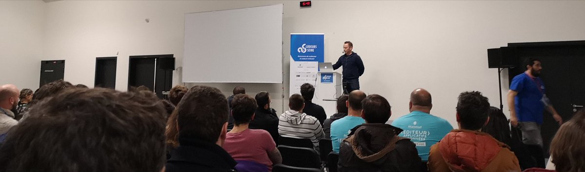
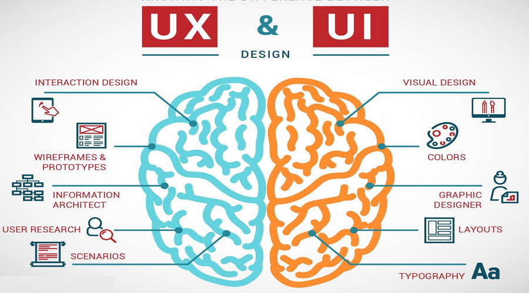

# Résumé de la conférence “UI/UX pour les développeurs”

## Cartouche d'identification

 - Manifestation : Codeurs En Seine Edition 2018
 - Lieu : Kindarena - Palais des sports de Rouen, 40 rue de Lillebonn
 - Conférence : UI/UX pour les développeurs
 - Horaire de la conférence : 11h00 - 11h40
 - Durée de la conférence : 40 min
 - Conférencier(s) :
   - Etienne Crombez : [Linkedin](https://fr.linkedin.com/in/etiennecrombez)
 - Audience : 1 présentateur ; 80 - 100 participants 
 - Auteur du billet : Valeria PETROV
 - Mots-clés : Interface, UI/UX, formulaire, tableaux de donnees, application.
 - URL de l'illustration : 

## Support
 - Lien vers le support (diapos) présenté en conférence : [Videos des conférences](https://www.youtube.com/channel/UCWujmG5rANxJI0nHbMFs08w/videos)
 - Nombre de diapos du support : 35
 - Plan du support :
   - Introduction
   - Definition de l’UI/UX
   - Formulaires
   - Tables
   - UI
   - Conclusion

## Résumé
Dans la conception web, nous retrouvons de plus en plus des notions telles que : 

 - UI - interface utilisateur (User Interface) ;
 - UX - expérience utilisateur (User eXperience).
 
L’interface utilisateur, c’est ce qui fait le lien entre l’humain et la machine. L’UI est le résultat d’un travail plus approfondi, celui de l’expérience utilisateur issue des besoins des internautes. Le but de l’UX est donc d’apporter des solutions efficaces aux problèmes et aux attentes des internautes.

Lors de cette conférence, Etienne Crombez nous a présenté certains conseils UI/UX qui ont comme but d'améliorer la compréhension et de faciliter l'utilisation des interfaces web. 

Les points abordés concernent la conception des :
 - Formulaires :
   - La définition des étapes à remplir ; 
   - Le positionnement des champs ; 
   - L’importance des valeurs par défaut, des radios, des cases, des butons et des menus roulants ;
   - La validation du formulaire.
 - Tables :
   - Le scroll vertical et horizontale ;
   - Les colonnes redimensionnables et triables ;
   - Densité du texte ;
   - Les graphiques ;
   - La vue rapide ;
   - Les filtres de la recherche.
 - Design :
   - La lumiere/l’ombre ;
   - L'arriere plan ;
   - L’utilisation des couleurs (noir et blanc) ;
   - L’espacement ;
   - Le texte et l’image ;
   - Le choix de la police.

Ces notions font parties des éléments essentiels de la création d’une application web. L'idée principale est de rester simple et de rendre agréable l’interaction de l’utilisateur avec l’application.

## Architecture et facteur qualité

Nous pouvons remarquer sur la figure ci-dessus que le concept UI/UX peut être vu comme un système responsable principalement de :

 - L’interaction homme-machine ;
 - Du design de l’application.

Ce sujet peut influer sur les facteurs suivants :

 - La capacité fonctionnelle - qui a comme but de répondre aux exigences et besoins des utilisateurs ;
 - La facilité d'utilisation - qui est lié à la compréhension et l'exploitation de l’application web.

